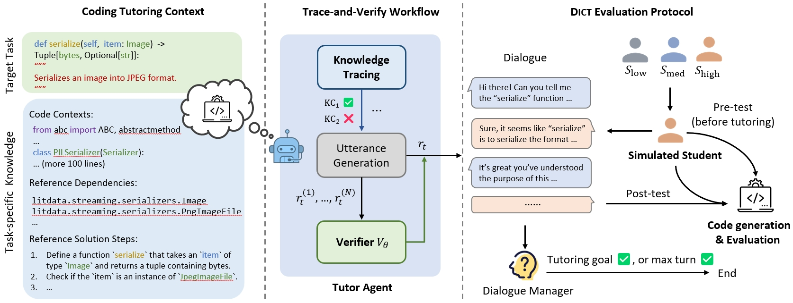
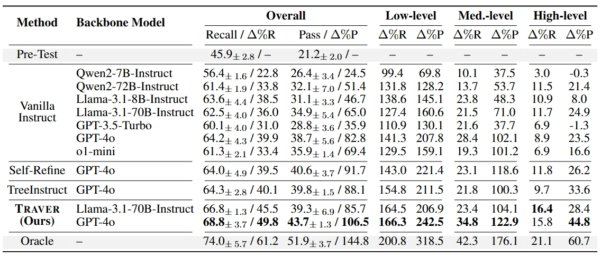
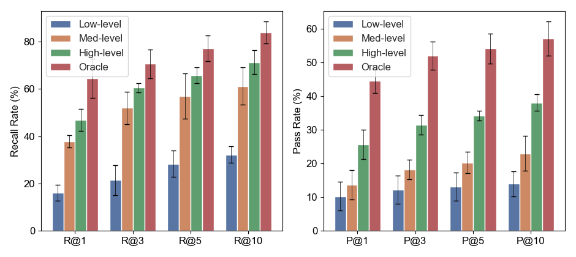
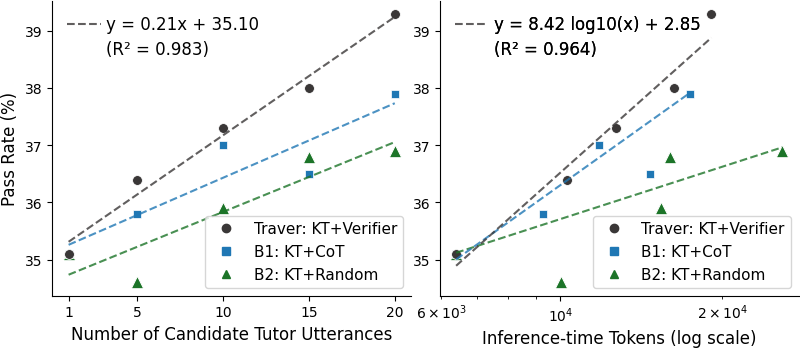

<h2 align="center"> Training Turn-by-Turn Verifiers for Dialogue Tutoring Agents:   The Curious Case of LLMs as Your Coding Tutors </h2>

📃<a href="https://arxiv.org/abs/2502.13311">arXiv</a>
•
<a href="" >🤗 Huggingface</a> (TBA)

This work explores the potential of LLMs as coding tutors. We propose Trace-and-Verify (**Traver**), an effective agent workflow that incorporates knowledge tracing and turn-by-turn verification, to tackle key challenges in coding tutoring. While this work focuses on coding tutoring as an example, the proposed method extends beyond coding to other task-tutoring scenarios, where the tutor must adapt content to users' varying levels of background knowledge. We further introduce Dialogue for Coding Tutoring (**DICT**), a novel evaluation protocol combining student simulation and coding tests to assess tutor performance. Such automated evaluation is critical for developing task-tutoring agents as it supports a systematic development and evaluation cycle.

  

## Coding Tutoring Evaluation

  

## Analysis of Simulated Students
Under a controlled setup, simulated students at different levels demonstrate distinct abilities in completing target coding tasks. Our DICT protocol serves as a feasible proxy for human evaluation, offering its advantages of scalability and cost-effectiveness for evaluating tutor agents.

  

## Inference-Time Scaling with Verifiers

Our proposed Traver agent workflow with the trained verifier shows inference-time scaling for coding tutoring:

  

## ⛏️ Usage

Coming soon...

## 📦 Released Data and Results
Please refer to `output/` for the released data and results.

## 📚 Citation

Coming soon...